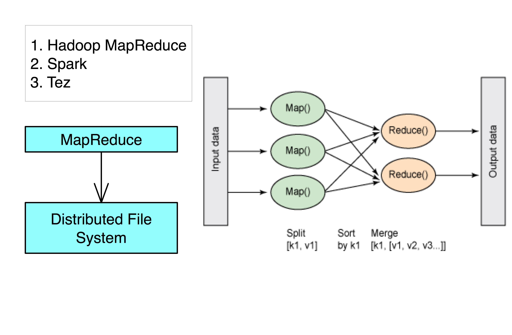

<head>
<script type="text/javascript"
  src="http://cdn.mathjax.org/mathjax/latest/MathJax.js?config=TeX-AMS-MML_HTMLorMML">
</script>

</head>

<style>

@font-face {
    font-family: "Computer Modern";
    src: url('http://mirrors.ctan.org/fonts/cm-unicode/fonts/otf/cmunss.otf');
}
#notebook_panel { /* main background */
    background: #888;
    color: #f6f6f6;
}
#notebook li { /* More space between bullet points */
margin-top:0.8em;
}
div.text_cell_render{
    font-family: 'Arvo' sans-serif;
    line-height: 130%;
    font-size: 135%;
    width:1000px;
    margin-left:auto;
    margin-right:auto;
}
div.cell.code_cell {  
    font-family: 'Arvo' sans-serif;
    line-height: 150%;
    font-size: 150%;
}

</style>


<center>

<p class="gap05"<p>
<h1>Big Data:</h1>
<h2>Essential Concepts and Tools</h2>
<p class="gap05"<p>
<h3>Darrell Aucoin</h3>

<h3>Stats Club</h3>

<p class="gap2"<p>
</center>
> In pioneer days they used oxen for heavy pulling, and when one ox couldn’t budge a log, they didn’t try to grow a larger ox. We shouldn’t be trying for bigger computers, but for more systems of computers.  
> —Grace Hoppe

<style type="text/css">
.input_prompt, .output_prompt {
    display:none !important;
}
</style>

# What is Big Data?


## The 4 V's of Big Data
__Volume__: The _quantity_ of data. 
- Usually too big to fit into the memory of a single machine.

__Veracity__: The _quality_ of data can vary. The inconsistency of data. 

__Variety__: Data often comes in a variety of __formats__ and __sources__ often needing to be combined for a data analysis.

__Velocity__: The speed of generation of new data.

### Volume
- 100 terabytes of data are uploaded to Facebook daily.

- 90% of all data ever created was generated in the past 2 years.

__Problem__: Impossible to do data analysis with one computer on data this size.

__Solution__: A distributed computing system.


###Veracity
- Big Data sets do not have the controls of regular studies  
    - Naming inconsistency  
    - Inconsistency in signal strength (i.e. Boston's Bump App, Google Flu)   
- Cannot simply assume data missing at random

Veracity naming inconsistency: a musician named several different ways in several different files

###Variety
- Most of Big Data is unstructured or semi-structured data  
    - Doesn't have the guarantees of SQL
- Data can be structured, semi-structured, or unstructured  
- Often have to combine various datasets from a variety of sources and formats  

###Velocity
- Speed that data is created, stored, analyzed to create actionable intelligence  
- Every min:  
    - 100 hours is uploaded to Youtube  
    - 200 million emails are sent  
    - 20 million photos are viewed  

- Often need to be very agile in creating a data product

# Tools
## Popular Hadoop Projects
__Hadoop__: A distributed file system and MapReduce engine YARN.

__Spark__: An in-memory based alternative to Hadoop's MapReduce which is better for machine learning algorithms. 
- Spark SQL, MLlib (machine learning), GraphX (graph-parallel computation), and Spark Streaming.

__Storm__: Distributed tool for processing fast, large streams of data.

__Cassandra__: NoSQL system implemented on Hadoop.

__Hive__: Allows users to create SQL-like queries (HQL) and convert them to MapReduce.

__HCatalog__: A centralized metadata management and sharing service for Hadoop, allowing a unified view of all data in Hadoop clusters.

__Pig__: An easy to learn hadoop-based language that is adept at very deep, very long data pipelines.

__Mahout__: A data mining library using the most popular data mining algorithms using the Map Reduce model.

## Non-Hadoop Projects  
__NoSQL (Not Only SQL)__: A database that is not based storage and retrieval of tabular relations used in relational databases. Some can provide a distributed database.  

__Examples__: MongoDB, CouchDB, Accumulo, and some NoSQL databases are implemented on Hadoop: Cassandra, HBase.

__SQL__: Can spill to disk allowing datasets to be larger than memory size.  

__MADlib__: Machine learning library extension for PostgreSQL.

## Hadoop Ecosystem


- The blue is the necessary components of a Hadoop Ecosystem
- Some tools provide several functionalities.
    - i.e. Hadoop is a distributed file system with MapReduce engine and scheduler.

### Distributed File System


__HDFS (Hadoop Distributed File System)__ is a distributed file-system across multiple interconnected computer systems (nodes).   
- Data is stored across multiple hard drives.

__Lustre__: DFS used by most enterprise High Performance Clusters (HPC). Usually uses a shared networked drive.

__Google File System (GFS)__: Google propriety distributed file system.

__MapR__: DFS inspired by HDFS but written in C++ instead of Java. 

### MapReduce


- MapReduce is the engine that processes data in a Hadoop Ecosystem.
- Spark and Tez uses a more flexiable in memory model of MapReduce which is better for Machine Learning algorithms.

### Scheduler


In order for multiple people to run on the same cluster, a scheduler is needed.

### Data Manipulation


These are the tools to help parse, transform, and combine various datasets.

- Hive, Spark SQL, Impala, Cassandra, and HBase all use a SQL-like language to help manipulate data.
- Hive can be implemented using the Spark MapReduce Engine (significantly speeding it it's processes).

### Data Analysis


There are several Machine Learning algorithms already in place for the Hadoop Ecosystem.

- Mahout can be implemented on Spark, Tez, and Hadoop
- Spark also has GraphX, which uses graphs to perform analytics (PageRank, etc.)

There is also specialized tools:

__Hadoop Image Processing Interface (HIPI)__: Image processing package helping to determine image similarity.

__SpatialHadoop__: Extension to process datasets of spatial data in Hadoop.

### Serialization


Parsing, transforming and combining the data into a useable dataset can be time consuming. Thus, once a suitable amount of work is done to create a useable dataset it is best to save it for future work. 

Serialization saves the state of the data, allowing it to be recreated at a later date.

- JAVA Serialization is the worst of the above and should only be used for legacy reasons

__Avro:__ Serialization made for Hadoop.

__JSON:__ Java Script Object Notation is a convenient way of describing, serializing, and transferring data.

__Protocol Buffers:__ More optimal serialization that requires the precise structure of the data when job is being run. Has less support for programming languages.

__Parquet:__ A columnar data storage format, allowing it perform well for structured data with a fair amount of repetition.

### Data Transfer


Data transfer of large amounts of data to and from dfs.

__Flume, DistCp__: Move files and flat text into Hadoop.

__Sqoop__: Move data between Hadoop and SQL.

### Streaming


__Streaming__ provides new calculations based on incoming data.

__Example__: Netflix 'Trending Now' feature. 
Possibly with personalized medicine to use medical devices to detect heart attacks before they happen.

__Spark Streaming__: Uses a micro-batch model that checks updates every 0.5-10 seconds and updates it's model.

__Storm__: Uses either streaming or micro-batch updates to update model.

### Management and Monitoring


__Node configuration management__: Puppet, Chef. Change operating system parameters and install software.

__Resource Tracking__: Monitor the performance of many tools.

__Coordination__: Helps synchronize many tools in a single application: Zookeeper.

---

__Ambari__: Tool to help install, starting, stopping, and reconfiguring Hadoop cluster.

__HCatalog__: Central catalog of file formats and locations of data. Data looks like a table-like to user. 

__Nagios__: Alert failures and problems through a graphical interface and alert administration though email of problems.

__Puppet, Chef__: Manager for configuration of a large number of machines.

__Zookeeper__: Helps coordination of tools.

__Oozie__: Workflow scheduler to start, stop, suspend and restart jobs, controlling the workflow so that no task is performed before it is ready.

__Ganglia__: Visualize how systems are being used and keeping track of general health of cluster.

### Security, Access Control, and Auditing


Hadoop in itself doesn't provide much security. As Hadoop increased in popularity, so has security projects.

Kerberos, Sentry, Knox are such projects.

### Cloud Computing and Virtualization


Sometimes you only need intermediate use of a cluster and creating/maintaining one of your own is prohibitively expensive. 

Cloud computing and virtualization tools provide easy construction of Hadoop environments with relative ease on cloud computering environments like [AWS](http://aws.amazon.com/).

### Distribution Platforms

Distribution platforms help (for a cost) easy installation and software maintaince of a Hadoop cluster. 

- Tool versions are checked for compatability, usually meaning that they are not the newest versions

Some of these are: [Cloudera](http://www.cloudera.com/content/cloudera/en/home.html), [MapR](https://www.mapr.com/), and [Hortonworks](http://hortonworks.com/).

# MapReduce  
__Problem__: Can't use a single computer to process the data (take too long to process data).

__Solution__: Use a group of interconnected computers (processor, and memory independent).

__Problem__: Conventional algorithms are not designed around memory independence.

__Solution__: MapReduce

__Definition.__ _MapReduce_ is a programming paradigm model of using parallel, distributed algorithims to process or generate data sets. MapRedeuce is composed of two main functions:

__Map(k,v)__: Filters and sorts data.

__Reduce(k,v)__: Aggregates data according to keys (k).

## MapReduce Phases

MapReduce is broken down into several steps:

1. Record Reader
2. Map
3. Combiner (Optional)
4. Partitioner
5. Shuffle and Sort
6. Reduce
7. Output Format

## Record Reader

__Record Reader__ splits input into fixed-size pieces for each mapper.

- The key is positional information (the number of bytes from start of file) and the value is the chunk of data composing a single record.


- In hadoop, each map task's is an input split which is usually simply a HDFS block
    - Hadoop tries scheduling map tasks on nodes where that block is stored (data locality)
    - If a file is broken mid-record in a block, hadoop requests the additional information from the next block in the series

## Map
__Map__ _User defined function_ outputing intermediate key-value pairs


__key__ ($k_{2}$): Later, MapReduce will group and possibly aggregate data according to these keys, choosing the right keys is here is important for a good MapReduce job.

__value__ ($v_{2}$): The data to be grouped according to it's keys.

## Combiner (Optional)

__Combiner__ _UDF_ that aggregates data according to intermediate keys on a mapper node


- This can usually reduce the amount of data to be sent over the network increasing efficiency  

$$\left.\begin{array}{r}
\left(\mbox{"hello world"},1\right)\\
\left(\mbox{"hello world"},1\right)\\
\left(\mbox{"hello world"},1\right)
\end{array}\right\} \overset{\mbox{combiner}}{\longrightarrow}\left(\mbox{"hello world"},3\right) $$

- Combiner should be written with the idea that it is executed over most but not all map tasks. ie. $$\left(k_{2},v_{2}\right)\mapsto\left(k_{2},v_{2}\right)$$

- Usually very similar or the same code as the reduce method.

## Partitioner
__Partitioner__ Sends intermediate key-value pairs (k,v) to reducer by   $$\mbox{Reducer}=\mbox{hash}\left(\mbox{k}\right)\pmod{R}$$  


- will usually result in a roughly balanced load accross the reducers while ensuring that all key-value pairs are grouped by their key on a single reducer. 
- A balancer system is in place for the cases when the key-values are too unevenly distributed.
- In hadoop, the intermediate keys ($k_{2},v_{2}$) are written to the local harddrive and grouped by which reduce they will be sent to and their key.

## Shuffle and Sort
__Shuffle and Sort__ On reducer node, sorts by key to help group equivalent keys


## Reduce
__Reduce__ _User Defined Function_ that aggregates data (v) according to keys (k) to send key-value pairs to output


## Output Format
__Output Format__ Translates final key-value pairs to file format (tab-seperated by default).


### MapReduce Example: Word Count

  
Image Source: [Xiaochong Zhang's Blog](http://xiaochongzhang.me/blog/)

## DAG Models
A more flexible form of MapReduce is used by Spark using __Directed Acyclic Graphs (DAG)__. 
  

For a set of operations:  

1. Create a DAG for operations
2. Divide DAG into tasks
3. Assign tasks to nodes

# MapReduce Programming Models
- Looking for parameter(s) ($\theta$) of a model (mean, parameters of regression, etc.)  
  
  
1. __Partition and Model__: 
    1. Partition data, 
    2. Apply unbiased estimator, 
    3. Average results.
2. __Sketching / Sufficient Statistics__: 
    1. Partition data, 
    2. Reduce dimensionality of data applicable to model (sufficient statistic or sketch), 
    3. Construct model from sufficient statistic / sketch.
   

 
## Partition and Model
  

### Notes  

 $\overline{\hat{\theta}}$ is as efficient as $\hat{\theta}$ with the whole dataset when:
1. $\hat{\theta}\sim N\left(\theta,\sigma^{2}\right)$ 
2. $x$ is IID and 
3. $x$ is equally partitioned  

- Can use algorithms already in R, Python to get $\hat{\theta}_i$
- $\overline{\hat{\theta}}\sim N\left(\theta,\frac{\sigma_{\hat{\theta}}^{2}}{\beta}\right)$ by Central Limit Theorem

### Restrictions
- Values must be IID (i.e. not sorted, etc.)
- Model must produce an unbiased estimator of $\theta$, denoted $\hat{\theta}$
- $\sigma_{\hat{\theta}}^{2}<\infty$

## Sketching / Sufficient Statistics
__Streaming (Online) Algorithm__: An algorithm in which the input is processed item by item. Due to limited memory and processing time, the algorithm produces a summary or “__sketch__” of the data.

__Sufficient Statistic__: A statistic with respect to a model and parameter $\theta$, such that no other statistic from the sample will provide additional information.

- Sketching / Sufficient Statistics programming model aims to break down the algorithm into sketches which is then passed off into the next phase of the algorithm.

  

### Notes  

- Not all algorithms can be broken down this way.

### Restrictions
- All sketches must be communicative and associative
    - For each item to be processed, the order of operations __must not__ matter

## Example: Mean  

### Partition and Model
  
$$\begin{aligned}\hat{\theta}=\frac{1}{n}\sum_{i=1}^{n}x_{i} &  & \overline{\hat{\theta}}=\frac{1}{\beta}\sum_{i=1}^{\beta}\hat{\theta}_{i}\end{aligned}
$$
  

### Sufficient Statistic / Sketch
 

## Example: Mean Code


    from numpy.random import randint, chisquare
    import numpy as np
    X = sc.parallelize(randint(0, 101, 200000))
    X_part = X.repartition(10).cache()

### Example: Mean - Partition and Model


    def mean_part(interator):
        x = 0
        n = 0
        for i in interator:
            x+=i
            n+=1
        avg = x / float(n)
        return [[avg, n]]
    model_mean_part = X_part.mapPartitions(mean_part)  \
        .collect()


    model_mean_part


    [[50.336245888157897, 19456],
     [50.215136718750003, 20480],
     [50.007421874999999, 20480],
     [50.135214401294498, 19776],
     [50.141858552631582, 19456],
     [50.08115748355263, 19456],
     [50.2578125, 20480],
     [50.243945312500003, 20480],
     [49.786543996710527, 19456],
     [50.072363281249999, 20480]]


### Example: Mean - Partition and Model
The partitions are not equally sized, thus we'll use a weighted average.


    def weighted_avg(theta):
        total = 0
        weighted_avg = 0
        for i in xrange(len(theta)):
            weighted_avg += theta[i][0] * theta[i][1]
            total+= theta[i][1]
        theta_bar = weighted_avg / total
        return theta_bar
    print("Mean via Partition and Model:")
    weighted_avg(model_mean_part)

    Mean via Partition and Model:


    50.128590000000003


### Example: Mean - Sufficient Statistics / Sketching


    sketch_mean = X_part.map(lambda num: (num, 1)) \
        .reduce(lambda x, y: (x[0]+y[0], x[1]+y[1]) ) 
    x_bar_sketch = sketch_mean[0] / float(sketch_mean[1])
    print("Mean via Sketching:")
    x_bar_sketch

    Mean via Sketching:


    50.128590000000003


## Example: Variance  
 $$\begin{aligned}\mbox{Sample Var}=\hat{\theta} & =\frac{1}{n-1}\sum_{i=1}^{n}\left(x_{i}-\overline{x}\right)^{2}\\
 & =\frac{1}{n-1}\left[\sum_{i=1}^{n}x_{i}^{2}-n\times\left(\overline{x}\right)^{2}\right]
\end{aligned}$$  

$$\begin{aligned}\mbox{Sufficient Stat}=\sum_{i=1}^{N}x_{i}^{2}, &  & \sum_{i=1}^{N}x_{i}, &  & N\end{aligned}$$

### Example: Variance - Partition and Model


    def var_part(interator):
        x = 0
        x2 = 0
        n = 0
        for i in interator:
            x += i
            x2 += i **2
            n += 1
        avg = x / float(n)
        var = (x2 - n * avg ** 2) / (n-1)
        return [[var, n]]
    var_part_model = X_part.mapPartitions(var_part)   \
        .collect()
    print("Variance via Partitioning:")
    print(weighted_avg(var_part_model))

    Variance via Partitioning:
    851.095985421


### Example: Variance - Sufficient Statistics / Sketching


    sketch_var = X_part.map(lambda num: (num, num**2, 1)) \
        .reduce(lambda x, y: (x[0]+y[0], x[1]+y[1], x[2]+y[2]) ) 
    x_bar_4 = sketch_var[0] / float(sketch_var[2])
    N = sketch_var[2]
    print("Variance via Sketching:")
    (sketch_var[1] - N * x_bar_4 ** 2 ) / (N -1) 

    Variance via Sketching:


    851.07917000774989


# Questions?

## Linear Regression

To understand the MapReduce framework, lets solve a familar problem of Linear Regression. For Hadoop/MapReduce to work we MUST figure out how to parallelize our code, in other words how to use the hadoop system to only need to make a subset of our calculations on a subset of our data.

__Assumption__: The value of p, the number of explanatory variables is small enough for R to easily handle i.e.  
$$n\gg p$$  

We know from linear regression, that our estimate of $\hat{\beta}$:  
$$X^{T}X\hat{\beta}=X^{T}y$$

$\left(X^{T}X\right)_{p\times p}$ and $\left(X^{T}y\right)_{p\times1}$ is small enough for R to solve for $\hat{\beta}$, thus we only need $X^{T}X,X^{T}y$ to get $\hat{\beta}$.  

To break up this calculation we break our matrix $X$ into submatricies $X_{i}$:  
$$X=\begin{bmatrix}X_{1}\\
X_{2}\\
X_{3}\\
\vdots\\
X_{n}
\end{bmatrix}		y=\begin{bmatrix}y_{1}\\
y_{2}\\
y_{3}\\
\vdots\\
y_{n}
\end{bmatrix}$$  

$$X^{T}X	=	\begin{bmatrix}X_{1}^{T} & X_{2}^{T} & X_{3}^{T} & \cdots & X_{n}^{T}\end{bmatrix}\begin{bmatrix}X_{1}\\
X_{2}\\
X_{3}\\
\vdots\\
X_{n}
\end{bmatrix} \implies$$

$$X^{T}X	=	\begin{bmatrix}X_{1}^{T}X_{1}+ & X_{2}^{T}X_{2}+ & X_{3}^{T}X_{3}+ & \cdots & +X_{n}^{T}X_{n}\end{bmatrix}$$  

$$X^{T}y=\begin{bmatrix}X_{1}^{T} & X_{2}^{T} & X_{3}^{T} & \cdots & X_{n}^{T}\end{bmatrix}\begin{bmatrix}y_{1}\\
y_{2}\\
y_{3}\\
\vdots\\
y_{n}
\end{bmatrix}\implies$$

$$ X^{T}y=\begin{bmatrix}X_{1}^{T}y_{1}+ & X_{2}^{T}y_{2}+ & X_{3}^{T}y_{3}+ & \cdots & +X_{n}^{T}y_{n}\end{bmatrix}$$

```R
Sys.setenv("HADOOP_PREFIX"="/usr/local/hadoop/2.6.0")
Sys.setenv("HADOOP_CMD"="/usr/local/hadoop/2.6.0/bin/hadoop")
Sys.setenv("HADOOP_STREAMING"=
    "/usr/local/hadoop/2.6.0/share/hadoop/tools/lib/hadoop-streaming-2.6.0.jar")
library(rmr2)
library(data.table)
#Setup variables 
p = 10 
num.obs = 200
beta.true = 1:(p+1) 
X = cbind(rep(1,num.obs), matrix(rnorm(num.obs * p), 
    ncol = p))
y = X %*% beta.true + rnorm(num.obs) 
X.index = to.dfs(cbind(y, X)) 
rm(X, y, num.obs, p) 
```

```R
map.XtX = function(., Xi) {
    Xi = Xi[,-1] #Get rid of y values in Xi
    keyval(1, list(t(Xi) %*% Xi)) 
}
map.Xty = function(., Xi) {
    yi = Xi[,1] # Retrieve the y values
    Xi = Xi[,-1] #Get rid of y values in Xi
    keyval(1, list(t(Xi) %*% yi)) 
}
Sum = function(., YY) {
    keyval(1, list(Reduce('+', YY))) 
}
```


    %%R
    Sys.setenv("HADOOP_PREFIX"="/usr/local/hadoop/2.6.0")
    Sys.setenv("HADOOP_CMD"="/usr/local/hadoop/2.6.0/bin/hadoop")
    Sys.setenv("HADOOP_STREAMING"=
        "/usr/local/hadoop/2.6.0/share/hadoop/tools/lib/hadoop-streaming-2.6.0.jar")
    library(rmr2)
    library(data.table)
    #Setup variables 
    p = 10 
    num.obs = 200
    beta.true = 1:(p+1) 
    X = cbind(rep(1,num.obs), matrix(rnorm(num.obs * p), 
        ncol = p))
    y = X %*% beta.true + rnorm(num.obs) 
    X.index = to.dfs(cbind(y, X)) 
    rm(X, y, num.obs, p) 
    ##########################
    map.XtX = function(., Xi) {
        Xi = Xi[,-1] #Get rid of y values in Xi
        keyval(1, list(t(Xi) %*% Xi)) 
    }
    map.Xty = function(., Xi) {
        yi = Xi[,1] # Retrieve the y values
        Xi = Xi[,-1] #Get rid of y values in Xi
        keyval(1, list(t(Xi) %*% yi)) 
    }
    Sum = function(., YY) {
        keyval(1, list(Reduce('+', YY))) 
    }

- The reason we are returning a list in the map function is because otherwise Reduce will only return a some of the elements of the matricies. 

    - list prevents this by Reduce iterating though the elements of the list (the individual $X_{i}^{T}X_{i}$  matricies) and applying the binary function '+' to each one.

    - list is used in the reduce function `Sum` because we will also use this as a combiner function and if we didn't use a list we would have the same problem as above.

```R
XtX = values(from.dfs(
    mapreduce(input = X.index,
    map = map.XtX,
    reduce = Sum,
    combine = TRUE)))[[1]]

Xty = values(from.dfs(
    mapreduce(
    input = X.index,
    map = map.Xty,
    reduce = Sum,
    combine = TRUE)))[[1]]
beta.hat = solve(XtX, Xty)
print(beta.hat)
```


    %%R
    XtX = values(from.dfs(
        mapreduce(input = X.index,
        map = map.XtX,
        reduce = Sum,
        combine = TRUE)))[[1]]
    
    Xty = values(from.dfs(
        mapreduce(
        input = X.index,
        map = map.Xty,
        reduce = Sum,
        combine = TRUE)))[[1]]
    beta.hat = solve(XtX, Xty)
    print(beta.hat)


               [,1]
     [1,]  1.045835
     [2,]  1.980511
     [3,]  2.993829
     [4,]  4.011599
     [5,]  5.074755
     [6,]  6.008534
     [7,]  6.947164
     [8,]  8.024570
     [9,]  9.024757
    [10,]  9.888609
    [11,] 10.893023


# Questions?


    #sudo ipython nbconvert Big_Data_Essential_Concepts.ipynb --to slides --post serve
